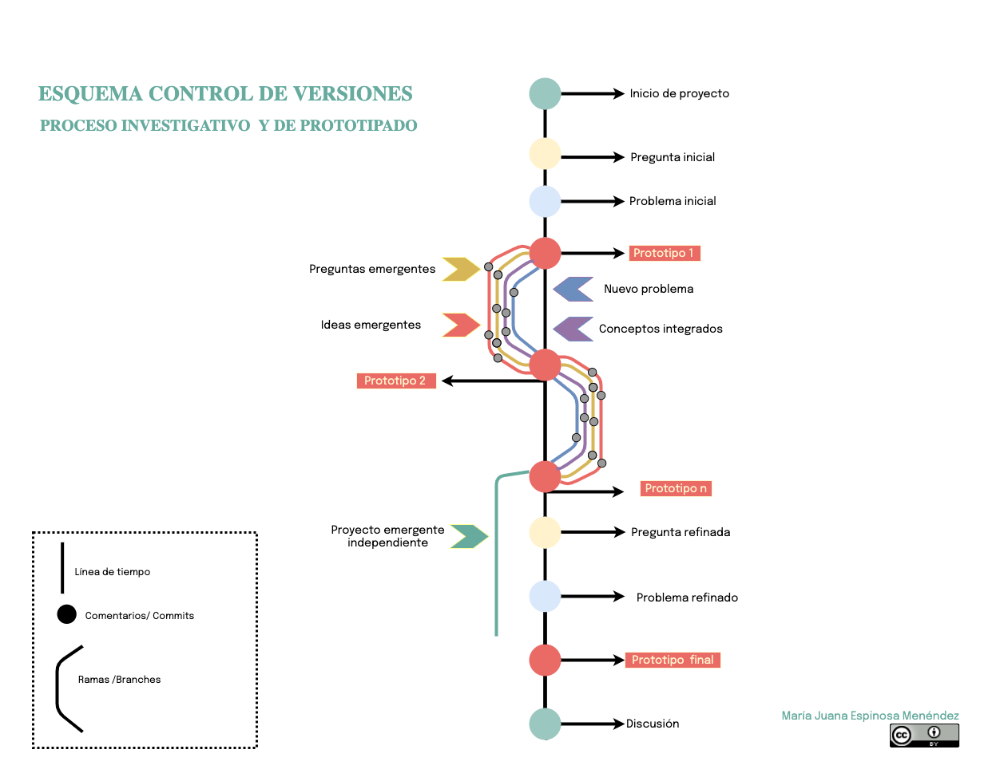

# El lenguaje del botsque: pensar los prototipos para integrar las plantas como agentes no humanos en entornos colaborativos

### Índice

I

Introducción

Metodologías injertas: prespectivas del diseño para las humanidades

¿De que manera podemos abordar este problema desde las humanidades digitales? 

Plantar la discusión: Las plantas como agentes (abordajes interdisciplinarios perspectivas teóricas)

¿Cómo pensamos las plantas?

Las raíces del problema: ¿Qué es de la planta la planta digital?

¿Qué ocurre cuando pensamos las plantas en infraestructuras digitales ? 

De la Extracción a la siembra de datos colaborativa: rutas y prototipos

¿Cuál fue el recorrido, cuáles los modos y cuáles los hallazgos?

El lenguaje del botsque : prototipo para pensar la agencia de lo no humano en entornos colaborativos

¿De qué manera podemos diseñar un entorno colaborativo en la que las plantas sean agentes? 

Conclusiones

Referencias

Anexos

##   Introducción

Al menos son dos los objetos de las humanidades digitales: 1) implementar y desarrollar herramientas digitales para la investigación y transferencia de conocimiento de las disciplinas y 2) dialogar con las herramientas para dar discusiones conceptuales y teóricas.[^1]. La primera perspectiva se desarrolla a partir de conocimientos de las ciencias de la información, bibliotecología, archivística, ingenierías de sistemas, informática, electrónica, desarrollo de software, etc. Estas disciplinas disponen de metodologías que permiten a los humanistas organizar corpus de datos, hacer análisis de los mismos, visualizarlos, crear y gestionar colecciones o desarrollar software específico para analizar, comprender o resolver sus problemas particulares. A este modelo de implementación o desarrollo de herramientas desde perspectivas y necesidades humanistas se suma la posibilidad de hacer investigación sobre el diálogo entre los diversos campos de las humanidades y las tecnologías y herramientas digitales[^2]. Aunque una perspectiva no excluye a la otra, es claro que la primera busca implementar o validar un prototipo para resolver un problema. La segunda perspectiva por su parte, busca mediante la implementación y el prototipo experimentar para dar cuenta de las tensiones y posibilidades que se dan entre herramientas y conocimientos disciplinares [^3].

En este sentido, esta tesis explora la segunda perspectiva, al discutir cómo la implementación de herramientas colaborativas, en particular una wiki semántica etnobotánica (relaciones seres humanos-plantas), me permitió reconocer en el prototipo un dispositivo experimental para pensar tanto el problema de las herramientas colaborativas como las relaciones seres humanos-plantas. Es decir, las tensiones y diálogos entre herramientas digitales y conocimiento etnobotánico. Durante la investigación el prototipado de las herramientas, en sus diferentes fases e iteraciones, pasaron de metodologías de diseño participativo o centrado en usuarios a una metodología de diseño centrado en conceptos problema. De ahí que en el proceso emergieron todos los actores humanos y no humanos involucrados en dar cuenta de las relaciones plantas-seres humanos. A esta altura de la experimentación se refinó el problema, se precisaron los actantes y emergió la pregunta de qué condiciones son necesarias para que las herramientas colaborativas se configuren como un espacio en el que humanos y no humanos -en este caso plantas- se integren como actores del conocimiento colaborativo. Esta pregunta, que parte del reconocimiento de las plantas como actantes en la construcción de conocimiento sobre ellas y cuya relación con los seres humanos puede modelarse mediante herramientas digitales colaborativas, solo fue posible una vez recorrí la perspectiva de implementación de herramientas colaborativas para una necesidad de una comunidad y me encontré con una perspectiva crítica del diseño para analizar categorías como "planta" y el software mismo. Un problema que emergió al poner a prueba el problema inicial mediante diversos prototipos. 

Abordar la agencia de la plantas como actores en la construcción del conocimiento colaborativo en herramientas digitales introduce en las humanidades digitales las discusiones sobre lo no humano que abordan las pos humanidades desde la filosofía, la antropología y estudios de la ciencia en diálogo a la biología y la etnografía [^3]. Si bien la manera como las plantas se pueden comunicar está en campos experimentales aún, ya se reconoce que tienen memoria y por lo tanto aprenden. Igualmente es claro que producen signos que comunican a los humanos, a los entornos y que, a través de sistemas más complejos, les permiten comunicarse entre sí. En diferentes latitudes del planeta las comunidades no solo reconocen la agencia de las plantas como parte de sus culturas sino que, describen las maneras como seres humanos y plantas entran en comunicación para reportar sus usos, por ejemplo a tavés de los sueños (Terangpi et al., 2015). De ahí que dar esta discusión desde las humanidades digitales me permite construir un diálogo interdisciplinario para hacer una aproximación crítica tanto a una software existente que es modelo de los entornos colaborativos, el Media wiki, como una modesta proposición de un modelo posible para una herramienta colaborativa hipotética, en la que se reconozca y active la agencia de las plantas con la mediación de agentes virtuales. 

Ya que la tesis quiere hacer explícitas las rutas metodológicas y por lo tanto los presupuestos como los métodos utilizados en relación al saber y el hacer en las Humanidades Digitales, la ruta argumentativa arranca por allí. ¿De qué manera llegué al problema de esta tesis luego de varios prototipos? Es decir ¿Cómo investigué en tanto humansita digital? ¿De qué manera conocí lo que conocí? ¿ De qué manera organicé el material y cómo decidí comunicarlo?  Preguntas de carácter ontológico, epistemológico y metodológico que abordo en el capítulo 1: "Metodologías injertas". Allí presento la discusión sobre la investigación como diseño, una discusión que desde los años ochentas valida el diseño cómo una vía de conocimiento. Discusión que me permite el prototipo en las humanidades digitales como una herramienta argumentativa. En este sentido hago una propuesta de documentación utilizando Git, el sistema de control de versiones y Git hub como una plataforma en la cual acopiar datos textuales y visuales. En cuanto a la investigación misma realizo un recorrido por las metodologías de diseño abordadas -de manera más intuitiva que predefinida- en los diferentes momentos de la investigación. Un recorrido que implica un giro metodológico que coincide con la incongruencia del prototipo final de una wiki semántica, la oportunidad de hacer un laboratorio de electrónica y plantas y la apertura a las discusiones del diseño crítico y especulativo. Este recorrido me permite afirmar que las perspectivas críticas y especulativas del diseño involucran metodologías de diseño que permiten expandir las relaciones entre los artefactosm, herramientas y humanidades. Desde allí es posible pensar los problemas que emergen de la vida y las disciplinas. 

En el capítulo 2: "Plantar la discusión" abordo el estatuto filosófico, antropológico y biológico de las plantas como un punto indispensable para pensar cualquier desarrollo de software o adecuación de un ya existente. Aquí dialogo con la Teoría Actor Red de Latour y la Semiótica de Peirce como marcos teóricos que permiten abordar lo no humano como agentes productores de signos y por lo tanto de información y conocimiento en diversos  contextos. Estas dos teorías tienen claras perspectivas metodológicas que fueron indispensables para abrir preguntas y pensar en los prototipos. 

En el capítulo 3 "Las raíces del problema" presento el recorrido en el refinamiento de la pregunta y el problema durante la investigación. Este proceso es documentado a través de el control de versiones Git. Este software me permite ver como el tema de las relaciones seres humanos y plantas requirió de un refinamiento de las preguntas y los problemas mediante procesos de prototipado y como se desprendieron ramas de discusiones que daban paso a nuevas investigaciones o desarrollos. Así, en este trayecto hago el seguimiento a las preguntas iniciales, emergentes, el refinamiento del problema, los prototipos realizados, los referentes encontrados, los conceptos integrados y las ideas emergentes. 

 En el capítulo 4 "De la extracción a la siembra de datos" presento cada uno de los prototipos bajo un modelo de informe de laboratorio para determinar las cuestiones emergentes que me llevaron a nuevas itereaciones en las que se refinaba el problema a partir de los hallazgos, hasta un punto final en el que se planea un prototipo acorde a un estado de la cuestión desde una perspectiva crítica de las herramientas y la construcción de los sujetos-objetos de estudio-investigación-croeación. 

 En el 5 capítulo: "El lenguaje del botsque", elaboro un esquema para una herramienta colaborativa que integre la agencia de las plantas con el uso de un agente virtual "botsque" en un entorno colaborativo. Prootipo con el que concluyo este trabajo y que me permite recomendar elementos para el desarrollo de herramientas ágiles, incluyentes, biocéntricas que impliquen un diseño centrado en lo vegetal para aboradar las relaciones plantas-seres humanos.

#### Hoja de Ruta

Para la comprensión argumentativa de este trabajo hay que  tener claros los siguientes momentos

1. Determinación de requerimientos. Enfoque bibliotecológico y comunitario
2. Exploracion de herramientas 1 -Omeka / Wiki / Inaturalist
3. Definición de un proyecto de wiki semántica
4. Prototipo de la wiki semántica "Mil país" para gestión de conocimiento
5. Replanteamiento de la wiki como prototipo y emergencia de tensiones éticas y concpetuales
6. Giro metodológico metodologías participativas tecnocentristas/ metodologías críticas especulativas biocentristas
7. Prototipo de una mesa huerta como sistema comunicativo 
8. Refinamiento del problea  con perspectivas críticas y éticas de las tecnologías
9. Diseño de un sistema de comunicación con agentes virtuales. Prototipo final. 

[^1]: Las relaciones entre tecnologías digitales y humanidades han trasegado desde la computación humanista, la informática comunitaria, la informática educativa y las humanidades digitales. Si bien en ninguna de estos campos existen definiciones disciplinares con programas teóricos y metodológicos claros, todas emergen dentro de la cultura digital o cibercultura. Los abordajes para su definición presentan un campo múltiple de aproximaciones en las que prima lo heterogéneo, interdisciplinario. Ver: del Rio Riande, M. G., & González Garcí Blanco, B. (2015). Introducción a las Humanidades Digitales. Material Didáctico Sistematizado. 103. https://www.aacademica.org/gimena.delrio.riande/115 Cuartas-Restrepo, J. M. (2017). Humanidades digitales, dejarlas ser. Revista Colombiana de Educación, 72(1), 65-78. https://doi.org/10.17227/01203916.72rce65.78 Galina Russell, I. (s. f.). ¿Qué son las humanidades digitales? 1 Julio de 2012, 12(7). Recuperado 4 de diciembre de 2016, de http://132.248.9.34/hevila/Revistadigitaluniversitaria/2011/vol12/no7/5.pdf Rueda Ortiz, R. (Ed.). (2013). Ciberciudadanías, cultura política y creatividad social (Primera edición). Universidad Pedagógica Nacional. 

[^2]: Los estudios de las tecnologías o la antropología de la ciencia tienen por objeto de estudio la tecnología y si bien dan cuenta de las relaciones de los actores humano y no humano su objetivo no es pensar el problema mismo desde el uso o experimentación con la tecnología. Esta manera de investigar por medio del hacer con una tecnología está más cerca de las metodoogías del diseño. 
[^3]: Como elaboraré en la metodología esta perspectiva coincide con lo que los diseñadores han llamado "Investigación como diseño" (Simon, 2015).
[^4]: Lo no humano en las humanidades se desarrollará en el III capítulo. La filosofía permite un marco para el reconocimiento ontológico a lo vegetal (Ver: Michael Marder),  la antropología un abordaje de la construcción de realidad, sentido y comunicación con lo no humano (Ver :Latour (2014), Kohn (2013)) y la biología una expansión de sus preguntas sobre inteligencia y comunicación vegetal (Ver Gagliano (2017), Mancuso (2015)

## I  Metodologías injertas: perspectivas del diseño para las humanidades

Técnicamente esta tesis se logró a un año de presentar este trabajo. Implementé una wiki semántica etnobotánica (relaciones seres humanos -plantas), por medio de formularios estructurados con estándares de metadatos (Dublin core, Foaf), en una interfaz amigable. La wiki alimentaba colaborativamente una base de datos relacional a la vez que respondía a los requerimientos del proyecto:  eficiencia en la estructuración, recuperación, migración e inter-operabilidad de la información y principios democráticos a la hora de construir el conocimiento de un campo específico (etnobotánica), mediante una estrategia colaborativa con comunidades. Sin embargo, aparecieron problemas de carácter conceptual, legal, ético y de diseño que reformularon el proyecto y sobre todo mi rol como humanista digital en formación. ¿Qué hacer cuando una vez logrado el objetivo inicial de una investigación emergen aspectos problémicos? ¿Es posible que una tesis refute la tesis que la originó? ¿De qué manera se relata, construye, discute y se comparte las vicisitudes de un proyecto? Pero sobre todo, ¿cómo llegué a saber más cosas sobre el problema de las relaciones seres humanos-plantas mediante la obervación, análisis y reflexión del prototipo logrado en ese momento? 

La pregunta de cómo investigué lo que investigué y sobre todo cómo llegué a refinar el problema me llevó a observar un modo particular en el hacer: investigar como diseño, investigar con diseño. La investigación como diseño es una propuesta que tiene sus orígenes en los años ochentas con las reflexiones que hizo en su momento Zeisel. El autor aborda los puntos en común entre diseñadores e investigadores a la hora de afrontar una situación a indagar o investigar. Allí, dice Zeisel (1984), ambos crean conceptos o imágenes, formulan hipótesis o presentan los conceptos y luegos los ponen a prueba. La investigación como diseño es en todo caso más que un paralelismo en los pasos o procesos para investigar. Es una ruta para pensar los problemas desde la creación de artefactos, prototipos (Dunne y Raby 2013). Es una manera de resolver los problemas (Gray y Malins 2004) o, una ruta para encontrarlos. Un modelo que involucra el pensamiento visual y práctico al pensamiento conceptual, del modo que lo hace la ingeniería, por ejemplo (Grand & Wiedmer, s. f.). Los prototipos por lo tanto, vendrían a ser la representación de las hipótesis que permiten desde sí mismos, comprender o -simular- las maneras como se comportan los problemas en un entorno. Es decir, pensamos con los prototipos y por ello, podemos hablar de sus funciones epistémicas.

Posicionar a los prototipos como instrumentos con funciones epistémicas y que por ello nos ayuda a pensar y desarrollar el pensamiento, nos lleva a la pregunta de cómo ocurre ello. Si bien esta pregunta tendría que ser respondida desde las ciencias cognitivas, o los estudios de la creatividad, la etnografía de los procesos creativos también nos permite precisar algunas vías para comprender este asunto.  Latour en sus etnografías de laboratorio y la constitución de la teoría actor red, introdujo varios elementos a tener en cuenta en la configuración de la ciencia y el conocimiento científico por ejemplo la participación simétrica de lo no humano en la configuración de la verdad en el laboratorio.. Así, además de la acción humana sobre el hecho a investigar, los dispositivos, artefactos y experimentos son "actantes" que determinan el conocimiento mismo. Latour habla de actantes y no de agentes  entendidos estos como "cualquier entidad que produzca una relación o adquiera valor de significación [...], y éste podrá ser humano o no humano. El actante se definirá por su capacidad de producir una acción dentro de una trama" ( Tirado y Doménech, 2005 citado por Moreira,2012, p.64). Si bien esa tesis es objeto de múltiples controversias, como se tratará en el capítulo teórico, tanto la discusión de Latour como la perspectivas semiótica de Peirce nos permite indagar sobre el lugar del prototipo en la construcción de un conocimiento en humanidades digitales, una discusión que ya se viene dando en este campo.

En el artículo  Developing Things: Notes toward an Epistemology of Building in the Digital Humanities Stephen Ramsay and Geoffrey Rockwell (2012) postulan las herramientas digitales como "telescopios para la mente", instrumentos hermeneúticos a través de los cuales  -y con los cuales- interpretamos fenómenos. Esta analogía, utilizada originalmente por la lingüista computacional Margaret Masterman, no solo es provocativa sino polémica. ¿Pueden las herramientas ser en el ejercicio investigativo parte de la discusión y de la explicación por que en sí mismas tienen elementos que discuten, problematizan, explican lo que se está  investigando?  Aunque su integración como argumento esté mediado por un discurso -pensemos en la mediación del curador de arte y la obra de arte- las herramientas, artefactos, modelos y obras cuentan con argumentoss que pueden ser leídos  por quienes dominan su lenguaje. De ahí que se requieran procesos de traducción. Pero, ¿cómo contar estas historias, como traducirlas? ¿Cuál el esquema narrativo de una tesis que quiere dar cuenta de estos procesos? 

##### Git: software de control de versiones

 Apoyada en la herramienta de control de versiones Git creada por Linus Torvals (2005), y ampliamente utilizada en el mundo del desarrollo del software, ideé una estrategia para organizar, categorizar y narrar los cambios que ocurrieron entre la creación de los prototipos y la revisión de los referentes. Esta narrativa permite hacer seguimiento a la persistencia del tema investigado -relaciones plantas-seres humanos- y la emergencia de preguntas, problemas e ideas así como, la integración de conceptos y referentes. Ver grafico 1.

Gráfico 1: Esquema control de versiones. Proceso investigativo y de prototipado. María Juana Espinosa.

El control de versiones Git permite registrar momentos en el tiempo de un proceso. Cada momento referenciado se registra a partir de un commit que es un comentario textual que resumen el avance, cambio, edición, adición etc., sobre el proyecto. Esto permite que quien desarrolla un software pueda regresar a momentos del desarrollo anteriores al presente apoyado por estas frases clave. Otro elemento que se destaca son las ramas. Desarrollos paralelos que se desprenden del desarrollo principal pero que no interfieren y que pueden volver a la rama princial una vez se resuelvan los problemas o desarrollen las funciones. Esta acción de unión de una rama se denomina merge. Si bien todo el flujo de trabajo en git está pensado para desarrollo de software, para el caso del control de cambios de un proyecto de investigación académica estimé necesario definir:

1. La rama principal o Master / Tema transversal del proyecto.
2. Los temas para hacer el seguimiento / Pregunta, Problema, Conceptos integrados, Ideas Integradas, Prototipos.
3. Las ramas que se desprenden / Cada tema de seguimiento es una rama que se une a la rama principal en un prototipo del que a su vez se desprenden los nuevos temas de seguimiento.
4. Los puntos de cambio en la rama principal / Cada prototipo es un punto de control de versiones donde se unen - o se hace merge en términos de git- los temas a los que se les hace seguimiento. 
5. Merge final / una vez el problema está refinado y la pregunta del proyecto se desarrolla en un prototipo se realiza el merge. 

Como se puede observar en el gráfico 2,  cuatro fueron los prototipos del proyecto: wiki semántica, app cofechas, mesa huerta y finalmente el lenguaje del botsque. En los primeros dos prototipos como se discutirá  en el capítulo "plantar el problema",  las plantas no fueron asumidas como actores o actantes -para tomar la noción de la teroía acción red- en la contrucción del conocimiento sobre sí mismas pese a intuir su protagonismo. El giro metodológico se concretó en un artefacto "La mesa huerta", que implicó la discusión de las infraestructuras, herramientas y postulados ontológicos de los dos prototipos anteriores. ¿Que son las plantas? ¿Como se representan en sistemas informáticos? ¿Cómo se dan y cuáles son las relaciones plantas-seres humanos? ¿De qué manera ellas contribuyen al conocimiento que de si mismas se registra en un entorno colaborativo? Estas preguntas me permitieron problematizar las herramientas y metodologías así como los presupuestos que subyacen a ellas.

El seguimiento en Git se realiza desde la terminal, con el uso de comandos específicos que permiten además conectarse remotamente con una copia de respaldo en Github. Github es un repositorio remoto que visualiza los procesos de control de versiones y permite trabajar colaborativamente en un proyecto de software o en este caso, para la discusión y refinamiento de ideas y problemas de un proyecto de investigación. Desde Github entonces, se completa la documentación de los prototipos y la escritura de la tesis. En el repositorio [Botsque-documento](https://github.com/mjespinosam/botsque-doc) está el control de versiones de la escritura de la tesis y como un submódulo anidado está el repositorio [ruta-metodológica](https://github.com/mjespinosam/ruta-metodologia). Los submódulos es una función de Git para tener en un repositorio otro repositorio de referencia conservando control de versiones separados. En el repositorio principal se pueden consultar los "issues" un espacio en el que trabajamos las discusiones del proceso concpetual, técnico y de escritura. En el submódulo se trabaja con la Wiki, espacio en el que quedan detallados cada uno de los referentes del proyecto según unas categorías de análisis. Ver: gráfico 3. Finalmente en el readme.md se presenta el proyecto y en la pestaña insights/networks se registran las rutas de los commits. Todo esto permite simular en la plataforma un trabajo de desarrollo de código pero con un desarrollo de la tesis. 

Gráfico 3. Marco analítico de referentes para los prototipos de la investigación. María 

Ahora bien, el uso de Git como experimento narrativo no responde solo a una necesidad de control de versiones de un documento sino también al registro de un proceso de construcción de pensamiento. El que durante más de dos años las preguntas hayan detonado nuevos experimentos y que además,  el problema después de todo ese tiempo se hubiese refinado al punto de llegar a intuiciones para un sistema comunicativo seres humanos-plantas es resultado del proceso. Este tipo de encuentros y discusiones quedan obscurecidas en versiones de preproyectos y correcciones sin documentar. Pareciera que todo proyecto fuera el desarrollo de una idea ya clara que tiende a reafirmar lo que allí se establece como hipótesis. Cuando lo que sucede es que dicha hipótesis ya fue refinada en múltiples discusiones y hallazgos. En campos como las Humanidades Digitales en particular, las hipotesis tienen uan serie de problemas conexos. Y es que al ser un área multi e interdisciplinaria, los aspectos a tener en cuenta emergen en el proceso mismo e inciden en los prototipos. Así que, ¿cuáles fieron las preguntas, los problemas y las metodologías que me permitieron hacer el recorrido hasta el problema refinado y el lenguaje del bosque? 

####  Metodologías para abordar y refinar preguntas y problemas

¿Qué es de la planta lo que una base de datos dice que es la planta? ¿Cuál es la participación de la planta en lo que sobre ella se dice en una plataforma colaborativa? ¿Puede ella colaborar en lo que de sí se dice y se construye en una plataforma que quiere poner de manifiesto las relaciones que tiene ella con los seres humanos? ¿Las plataformas colaborativas pueden dar cuenta de las relaciones plantas-seres humanos? La aparición de cada una de estas preguntas en esta tesis no fue un asunto a priori, si no el resultado de un proceso de investigación a partir de la consulta y estudio de referentes y el prototipado de plataformas colaborativas. Así, las preguntas fueron develando el problema subyacente al problema inicial. Pero, ¿es posible hacer una investigación sin un problema acotado? 

En las humanidades es usual que nuevas categorías aparezcan en el curso del desarrollo de la investigación. Generalmente se parte con unas categorías predeterminadas y aparecen nuevas categorías metodológicas o conceptuales en la medida que se expande el corpus teórico y se analizan datos (Rico de Alonso, 2005). Sin embargo, no es usual, ni metodológicamente deseable, que el problema cambie en el transcurso de la investigación. El problema responde a la identificación de vacios del conocimiento y su investigación tiene por objeto comprender, explicar y ampliar los conocimientos. Sin embargo, en esta investigación desde las Humanidades Digitales  el problema fue un problema. Las rutas metodológicas de diseño de investigación de las humanidades, excepto los estudios culturales o la etnohistoria [5^], no piensan en la confluencia de disciplinas para el abordaje de los problemas si bien en muchas investigaciones confluyen varias disciplinas. Por ello es usual que las investigadoras encontremos tensiones metodológicas antes los vacios del saber y el saber hacer en diversas disciplinas. Así, en esta investigación, como suele suceder en el diseño y en las artes, el problema tomó diversas materialidades -prototipos- y la investigación misma se encaminó a construir el problema interdisciplinariamente [6^]. Por lo tanto, el acotamiento del problema y su matertialización en un prototipo es el resultado de la investigación misma. Un recorrido que de paso posiciona la investigación como diseño (Grand, 2010; Jonas, 2010), una metodología que fue determinante para todo el proceso. Ver figura 4.

Gráfico 4. Los prototipos en la investigación en Humanidades Digitales 

#### La investigación como diseño

En las reflexiones sobre las metodologías de investigación en las artes y el diseño se  marca la diferencia entre la investigación en diseño y el diseño como investigación  (Simon, 2017). La investigación en diseño hace uso de métodos mixtos para responder una pregunta problema comunmente relacionada con el desarrrollo de un producto(^x). La investigación como diseño, por el contrario, piensa en las maneras como se investiga y las conexiones con el pensamiento en diseño: representación gráfica y prototipado. En este punto es donde se presenta la función epistémica de los prototipos pues a través de ellos, desde el diseño, se piensa el problema en si. 

 La observación del proceso de esta tesis me permitió reconocer una manera de abordar un problema de conocimiento en el cual la investigación como diseño (Grand, 2017) permite refinar el problema y generar al menos dos situaciones:

> Mientras el tema general se mantiene (construcción de conocimiento colaborativo-relaciones seres humanos-plantas-plataforma digital) el problema y por consecuencia la pregunta de investigación y los objetivos empiezan a iterar, alimentados por abordajes conceptuales y experimentos técnicos nuevos.
>
> Los prototipos en tanto objetos observables se presentan como medios para refinar el mismo problema.  

Por lo tanto la investigación como diseño implicó en este caso procesos de resolución de problemas de al menos cuatro tipos:

1. Resolución por pensamiento lateral. Es decir el despliegue de todas las opciones posibles para resolver el problema sin apelar a la  lógica ni a linealidad. Y esto como procesos de ideación. 
2. Resolución heurística de problemas.  Según Polya intervienen cuatro operaciones 1- entender el problema, 2- trazar el plan, 3- ejecutar el plan (resolver) 4- revisar. Este proceso anota García ( 2009) no es un proceso lineal sino dinámico y cíclico. 

1. Ensayo y error: como estrategia para el aprendizaje de las herramientas: omeka, wiki semántica, git, etc.
2. Algorítmica: aplicación de pasos detallados para resolver un problema. 

Cabe anotar que estos modos de resolución de problemas estuvieron muy relacionados con las metodologías de Soft System las cuales se derivan de los sistemas de información sobre todo basados en computadoras. Estos sistemas buscan mejorar una situación problémica aprendiendo del procesos de resolución del problema mismo desde una visión sistémica. Esta visión holística del problema permite ver el problema como un todo. Para ello se usan técnicas visuales de mapeo como gráficos, diagramas, ilustraciones, animaciones, etc. ([Gray and Malins 2004:92](zotero://open-pdf/library/items/GL9D93DZ?page=92)). 

Esquema 

Finalmente estos modelos de resolución de problemas también se traducen en la creación de instrumentos de recolección de información. Ese es el caso del [protocolo para los laboratorios de prototipado](https://github.com/mjespinosam/botsque-doc/blob/master/05-protocolo_prototipo.md). Este protocolo integra un modelo de informe de laboratorio con un modelo de resolución de problemas heurístico el cual busca que se comprenda el problema, se cree un plan, se ejecute y se analice. El asunto es poder dar cuenta del proceso dinámico, iterativo y cíclico sin perder detalles, procedimientos y aprendizajes. 

#### Metodologías de investigación en humanidades artes y diseño 

En la búsqueda de dar respuesta disciplinar al cómo conocemos la intersección entre las artes, el diseño, las tecnologías, las humanidades e incluso las ciencias se da un caso particular: la mixtura. Es usual que se de una apropiación y adpatación de metodologías y métodos de otras disciplinas en contextos investigativos desde el arte (Gray & Malins, 2004). De ahí que el diseño dialogue con la etnografía, la investigación acción participativa, por ejemplo. En todo caso y como he venido mostrando hay metodologías del diseño con las que ahora dialoga las humanidades e incluso metodologías de la ciencia que se incluyen para dar respuesta al cómo conocemos y de paso permitirnos conocer. Al respecto hago una diferencia entre metodologías que desarrollan infraestructuras para la investigación en humanidades digitales (gráfico 5), metodologías que integran en un objetivo diferentes áreas de conocimiento para el desarrollo integro de un prototipo digital (gráfico 6)  y las metodologías que hacen del prototipo una ruta para pensar el problema de las relaciones humanidades-infraestructuras digitales (gráfico 7). 

Las dos primeras se dan en diálogo con las ciencias y las humanidades y fueron desarrolladas en dos de los prototipos, Milapaís y Cofechas, mientras que la tercera es una metodología propia de las artes y el diseño que implementé intuitiva y luego sistemáticamente en los dos siguientes prototipos: Mesa Huerta y Lenguaje del Botsque. 

###### Herramientas para las Humanidades Digitales (HD). Los primeros experimentos con OMEKA

Los proyectos en HD suelen desarrollar o implementar herramientas digitales para poder explorar campos difícilmente abordables a través de la estructuración y análisis manuales de la información. Arqueología, lingüística (computacional) estudios literarios entre otras áreas, han impulsado el desarrollo o la implementación de herramientas digitales que permiten trabajar con un corpus considerable y así, reconocer hipótesis de trabajo, hacer hallazgos. Bases de datos, exposiciones virtuales, visualización, geo-referenciación, mapeo, corpus lingüísticos, ocurrencia de palabras y contextos de uso, referencias textuales, análisis figurativos-semióticos de pictogramas, jeroglíficos, etc, son algunas de los resultados de estas implementaciones que son en alguna manera herramientas de recolección, organización y análisis de datos. Desde allí es claro emergen hipótesis y es posible hacer lecturas que dificilmente se podrían hacer por metodologías fenomenológicas. Esta perspectiva tiende más al racionalismo y dialoga con los métodos de las ciencias duras. Trabajo de laboratorio, prueba de hipótesis y experimentaciones con protocolos. 


Grafíco 5. Creación  propia.

El hilo conductor de todo el proceso ha sido las relaciones seres humanos plantas o mejor plantas seres humanos. Inicialmente la investigación tuvo por objetivo la implementación de un software colaborativo - tipo wiki- de las relaciones "seres humanos-plantas". En ese primer momento el interés estaba dirigido a construir un referente para la adecuación de la [Base de Datos del Centro de Estudios de Medicina intercultural](https://github.com/mjespinosam/ruta-metodologia/wiki/CEMI). Un proyecto etnobotánico centrado en la construccion colaborativa de usos y aprovechamiento de las plantas. El preproyecto titulado "Savias wiki, una wiki etnobotánica"  estaba formulado desde el trabajo realizados con anterioridad en el colectivo Savias Sabias y desde una perspectiva bibliotecológica, ámbito en el que había trabajado por varios años.  Entre las tareas a realizar estaban: 

>* Estructurar  semántica de la información para una recuperación efectiva. 
>
>* Catalogar  los saberes etnobotánicos a partir de vocabularios controlados.
>
>* Incluir el lenguaje común -folksonomías- para aumentar o precisar vocabularios controlados.
>
>* Construir de manera colaborativa y democrática el conocimiento sobre las plantas y su aprovechamiento. 
>
>* Manifestar  las relaciones de las plantas con individuos y comunidades así como su pertencia a territorios.

Estos requerimientos implicaban que debía aprender de la estructuración de información, el conocimiento de las bases de datos y las posibilidad de las plataformas wiki. En su momento este saber era rudimentario así que empezamos a realizar en el Laboratorio de HD pequeños experimentos en Omeka. [Omeka](https://omeka.org/about/project/) es un software libre creado por  el Centro de Historia y Nueva Media Roy Rosenzweig para la admnistración y y gestión de colecciones de objetos digitales [6^]. para museos, archivos y biblitoecas. En este software, propuesto por la maestría como herramienta para experimientos, fue la primera vez que noté las dificultades para definir las plantas en un entorno digital. En ese entonces estaba frente al dilema de cómo crear una "planta" en Omeka:  ¿Podía capturar o crear digitalmente una planta como se hace en un proceso de digitalización desde un soporte análogo o en la creación de un libro, imagen, sonido digital? Para poder hacer un proceso análogo debía en principio crear la planta como un item en Omeka. Los items types en este software se corresponden a las entidades en las bases de datos. Es decir "cualquier objeto (real o abstracto) sobre el cual queremos tener información en la base de datos" (Conabio, s.f). En esta plataforma las entidades estan pensadas por tipos -types- que se corresponden a tipos de documentos digitales (textos, sonidos, imágenes, representaciones visuales) o digitalizados (libros, fotografías, música, etc.), recursos (páginas web, historia oral, eventos), individuos (personas), entre otras entidades. Fue así que creé "Planta" como un item que además decribí como "individuo".

Si bien esto era un proceso que pasaba por una acción técnica, al crear una entidad es preciso establecer los atributos y es un acto de nombramiento y descripción de la realidad de la manera como yo concibo que es. Una decisión ontológica. ¿Cuáles los atributos de una planta? ¿Nombre? ¿Forma? ¿Partes? ¿Componentes? En este software los atributos de todo objeto digital están estandarizados por un conjunto de metadados denominados Dublin Core. Este estandar de metadatos "datos que estructuran un dato" [7^] están pensados para objetos digitales más que para individuos: personas o plantas. Es decir que allí existía una segunda dificultad. Al tomar una fotografía de una planta y subirla a la plataforma el interés descriptivo no estaba sobre el "objeto digital imagen" sino sobre el objeto retratado. ¿Cómo adecuarme a esos metadatos o encontrar algunos alternos? Pero más allá del uso de uno y otro metadato ¿Qué son de la planta los metadados? ¿Son los metadatos universales? 

En el [experimento desarrollado](https://github.com/mjespinosam/ruta-metodologia/wiki/Omeka) creé entradas para plantas, las describí con los metadatos dublin core, utilicé vocabularios para la descripción y establecí una georeferenciación para cada item. Entre los problemas que surgieron apareció la dificultad para poder hacer el relacionamiento entre entidades de muchos a muchos. El nombre de una planta corrresponde a muchas plantas diferentes y  una planta puede tener muchos nombres específicos e incluso científicos. En este punto aunque el nombre científico se establece como un identificador único o clave primaria no es necesariamente la manera como se busca una planta ni su uso es generalizado entre las comunidades que se relacionan con las plantas. Como refernte estudié la base de datos de [Nombres comunes de plantas de Colombia](http://www.biovirtual.unal.edu.co/nombrescomunes/es/). Esta base de datos relacional se modeló para dar cuenta de las particularidades del nombramiento de las plantas: los nombres corresponden a una sola especie ( nombre unívocos), los nombres se aplican a dos o más especies ( nombres equívocos) o en muy poca frecuencia los nombres se aplican a una sola especie y para esa especie es el único nombre reportado ( biunivocos) (*Inicio - Nombres Comunes Plantas de Colombia*, s. f.). Construída a partir de una amplia bibliografía, documentos de herbarios y trabajo de campo, esta bases de datos no se organizó a partir del nombre científico sino a partir de un nombre común referente asociado a todos los otros nombres comunes o científicos reportados. En todo caso se puede hacer la búsqueda por ambos nombres uno común o uno científico. Esta base de datos no cuenta con un API que permita vincularla a otros desarrollos. No es una base de datos con datos abiertos ni tiene especificaciones para su documentación. Además su creación y crecimiento no es colaborativo. Por todo lo anterior el proyecto ya tenía una tarea pendiente: modelar lo que podría ser una base de datos relacional de muchos a muchos que permitiera los nombres unívocos, equívocos y biunívocos georeferenciados. Aprendizajes y experimentos que fueron realizándose con los prototipos que vinieron. 

##### Metodologías de las humanidades para las humanidades digitales. Milpaís: una Wiki semántica

El segundo modelo de metodología responde más a proyectos que trabajan factual o hipotéticamente con una comunidad de usuarios que pueden necesitar o serles útil una herramienta en particular.  Al reconocer una comunidad usuaria eso implica un abordaje en el cual el problema a resolver debe necesariamente dialogar e incluir claridades legales, éticas y de gestión (sobre todo sostenibilidad) del proyecto. Redes sociales temáticas, diseño de video juegos, proyectos transmedia, páginas interactivas, wikis, son algunos de los proyectos que resultan de estas metodologías. En este modelo tanto la informática comunitaria como la informática educativa tienen un papel importante pues están enfocadas en resolver problemas mediante la tecnología. Es por así decirlo una solución técnica a un problema social. La falencia de este modelo es su determinismo tecnológico y la ausencia crítica de las tecnologías en sí. Está estrechamente relacionado con el diseño centrado en el usuario y metodologías participativas de diseño, investigación acción y métodos etnográficos.  



Gráfico 6. Creación propia.

 Poner la atención en tecnologías o sistemas informáticas al servicio o para la resolución de un problema de índole social es una tendencia que desde los años 80´s congrega a aficionados y profesionales de la computación, u otras áreas. Cuando Grunstein publicó *Community Informatics: Enabling Communities with Information and Communications Technologies* (Idea Group, 2000) ya existían al menos 20 años de experiencias localizadas de informática comunitaria (IC). Este campo que no cuenta con unas metodologías propias para ser definido como disciplina, "se preocupa por mejorar la sociedad civil y fortalecer comunidades para la autogestión y para el medio ambiente y el sostenimiento económico,poder, desarrollo, asegurando que muchos que de otro modo quedarían excluidos puedan aprovechar las enormes oportunidades que presentan las nuevas tecnologías" (Gurstein, 2000, pág.2). Por lo tanto, allí discurren los conceptos de comunidad e implementación y diseño de tecnologías y aplicaciones. 

Si bien el acceso a las tecnologías y las herramientas implican que las sociedades salgan de lo que se denomina brecha digital, su implementación no necesariamente implica la apropiación y la comprensión de lo que implica la tecnología misma. La informática comunitaria siguiendo a Gurstein (2000)  incluye el acceso al hardware, el software, la conectividad y la información en contextos dondela tecnología sea aplicada a comunidades "físicas" [x^].  Esto implica que los usuarios como las comunidades deben ser parte del proceso de diseño de las implementaciones que se van a realizar. Pero, ¿incluye el diseño la dicusión de las implicaciones de las tecnologías en las comunidades? No necesariamente y por ello el tercer modelo metodológico que exploraremos más adelante.

En todo caso este segundo modelo fue el utilizado en dos prototipos Milpaís y Cofechas La implementación de la herramienta colaborativa dialogó con un paradigma fenomenológico -naturalista-  dede el cual se fundamentaron las metodologías investigación acción, provenientes de las humanidade. La investigación de los requerimientos tenian por objeto encontrar un sistema ajustado para catalogar las plantas e integrar comunidades con un sistema curatorial. Dos fueron los softwre testados: I ntarulist y Semantic media wiki 

###### Las raices del problema

El hilo conductor de todo este proceso ha sido las relaciones seres humanos plantas o mejor plantas seres humanos. Inicialmente la investigación tuvo por objetivo la implementación de un software colaborativo - tipo wiki- de las relaciones "seres humanos-plantas". En ese primer momento el interés estaba dirigido a construir un referente para la adecuación de la [Base de Datos del Centro de Estudios de Medicina intercultural](https://github.com/mjespinosam/ruta-metodologia/wiki/CEMI). Un proyecto etnobotánico centrado en la construccion colaborativa de usos y aprovechamiento de las plantas. Así, desde un paradigma fenomenológico -naturalista- con metodologías investigación acción, provenientes de las humanidades, la investigación avanzó en ese primer momento con la intención de darle forma a una herramienta - la wiki semántica- bajo unos requerimientos. A saber:

Pero no solo en el hacer con las herramientas surgieron las preguntas. La revisión de los referentes y un estudio por menorizado de ellas me llevó a establecer requerimientos antes no tenidos en cuenta. Inicialmente el proyecto quería aportar a la estructuración e implementación en las comunidades de la Base de Datos del Centro de Estudios en Medicina Intercultura CEMI, organización que viene adelantando con la Universidad del Rosario un trabajo exhaustivo y riguroso en los sistemas de medicina tradicional en Cota Cundinamarca y en el Vaupés. Esta base de datos tenía la infraestructura para ser colaborativa pero tenía al menos dos problemas: no tenía quien la alimentara y no contaban con un sistema de curaduría que permitiera verificar la calidad y pertinencia de la información dispuesta allí.   En conversaciones con quien en su momento era el gerente de proyectos establecí algunos compromisos frente al proyecto que en principio establecían claramente que mis intereses no eran económicos, que toda la información e incluso la base de datos era propiedad de la organización y que mi aporte estaría en el marco de una recomendación. El análisis de esta Base de Datos requirió de la lectura de los términos y condiciones y a la conversación con la abogada experta en propiedad intelectual y conocimientos tradicionales. A partir de allí empecé a reconocer las bibliotecas digitales que trabajaban temas etnobotánicos, las aplicaciones que en colombia abordaban este tema, desarrollos tipo wiki y otros sistemas colaborativos.  Inicialmente buscaba responder los siguientes temas:

1. Plataformas etnobotánicas
2. Plataformas colaborativas
3. Sistemas de estructuración y recuperación de la información
4. Tipo de vinculación de las personas y las comunidades en las plataformas
5. Vocbularios controlados sobre etnobotánica
6. Catalogación de conocimientos etnobotánicos

>* Estructuración semántica de la información para una recuperación efectiva. 
>
>* Catalogación de los saberes etnobotánicos a partir de vocabularios controlados.
>
>* Inclusión de lenguaje común -folksonomías- para aumentar o precisar vocabularios controlados.
>
>* Construcción colaborativa y democrática del conocimiento sobre las plantas y su aprovechamiento. 
>
>* Manifestación de las relaciones de las plantas con individuos y comunidades así como su pertencia a territorios.

 El primer y más importante referente para crear el prototipo de Milpaís fue [Inaturalist]( https://www.inaturalist.org/pages/what+is+it). Este software libre creado en el marco de una maestría de ciencias de la información de la universIdad de Berkley es actualmente una plataforma tipo red social que integra a la ciudadanía en la captura de datos sobre la biodiversidad. De este modo, información sobre especies animales, vegetales u hongos son reportados mediante imágenes o sonidos, y debidamente georeferenciados en la plataforma. Allí, una comunidad de expertos hace la verificación del nombramiento de tal modo que, se asegure la estructuración debida de los datos. Esta curaduría junto a una opción de oscurecimiento de información son dos de los elementos a destacar. La curaduría permite que la comunidad de expertos verifique la información y lo ajuste a los estándares científicos y estructuración de datos. Todos los datos están estructuradas bajos las categorías del estandar de metadatos Darwin Core. Este estandar  permite estructurar la información por  elementos de registro -¿qué se observa o escucha?-, registro biológico -¿cuáles son sus atributos?-, evento -¿a qué horas se realizó el registro?-, ubicación -¿dónde se realizó el registro?- y taxón -¿cuál es la especificación taxonómica?-,  excepto identificación que es una categoría que organiza los ID de la base de datos internamente y el contexto geológico.  En cuanto al oscurecimiento de la información esto permite que especies en peligro de extinción puedan reportarse pero mantenerse ocultos para protegerlas de traficantes, por ejemplo. Esta decisión es tomada tanto por quienes hacen las observaciones como por los curadores. El rol de los curadores es asignado por los administrados a partir de su participación o experiencia demostrada. Los curadores trabajan sobre la taxonomías, mediante modificaciones. Los curadores tienen potestad sobre lo que se obscurece a partir de criterios de riesgo. Toda la información está en su [guía  para curadores](https://www.inaturalist.org/pages/curator+guide). 

Ver [Observación inaturalist](https://www.inaturalist.org/observations/20189776)

La posibilidad de obscurecer informacion y el sistema curatorial de la información, respondían a dos problemas emergentes en el proceso de la investigación de Milpaís:  los peligros de información de plantas medicinales sin verificación famaceútica, médica, etc. y la necesidad de resguardar cierta información etnobotánica dentro de plataformas digitales. En cuanto a la curaduría inaturalist me permitió identificar un esquema de relacionamiento entre expertos y aficionados para la estabilización de la información. Sus criterios de evaluación de calidad de datos, los procedimientos colaborativos para rectificar o asignar nombramientos son dos estrategias que funcionarian perfectamente en una paltaforma etobotánica. Ello aseguraría la democratización en la construcción del conocimiento y la fiabilidad de los datos. De tal modo se controlarían los riesgos de toxicidad, interacciones entre componente y tratamientos, entre otras cosas. En cuanto a la posibilidad de obscurecimiento de información es claro que ante la inexistencia de legislación respecto a la protección de saberes tradicionales, los saberes etnobotánicos son propensos a la apropiación indebida o la biopiratería. ¿Qué quiere decir esto? ¿Cómo prevenirlo?

La información etnobotánica, según reporta la Organización Mundial de la Propiedad Intelectual (OMPI), está en riesgo de apropiación indebida. El riesgo yace en las falencias para el establecimiento de legislaciones nacionales sobre derechos tradicionales de propiedad colectiva y la posibilidad de la usurpación de saberes tradicionales mediante patentes y por parte de particulares con intereses económicos. En este contexto la [Biblioteca digital de medicinas tradicionales de la India](http://www.tkdl.res.in/tkdl/langdefault/common/Home.asp) (TDK) fundamentó en el proyecto de Milpais la necesidad de establecer una discusión con la situación legal de dicho conocimiento en entronos digitales. La TDK es además un  modelo de estructuración de información para la protección y prevención de biopiratería [^6] Tras descubrir que varias de las plantas y prácticas medicinales tradicionales estaban siendo patentadas -la cúrcuma por ejemplo- el gobierno Indio decidió crear esta biblioteca. Allí se recopila el saber de varias tradiciones de medicina hindúes en sus lenguas originales y traducidas em 5 idiomas. El propósito es que las oficinas de patentes de todo el mundo verifiquen antes de conceder una patente. Como se puede revisar en la [wiki de referentes en github](https://github.com/mjespinosam/ruta-metodologia/wiki) la TDK estructura la información siguiendo el modelo de clasificación internacional de patentes(CIP) pero añadiento campos de descripción. En la CIP "hasta 2005, solo había un subgrupo –el A61K35/78– correspondiente a plantas medicinales, lo que significaba que los examinadores de patentes no disponían de los recursos óptimos para revisar solicitudes de patentes basadas en medicinas tradicionales" (La protección de los conocimientos tradicionales de la India, s. f.) Por lo que con el trabajo de la TDK se establecieron 207 subgrupos nuevos además de los 27 mil subgrupos presentados por la TDK en lo que denominaron: Clasificación de recursos de conocimientos tradicionales en sus siglas en inglés TKRC. Este modelo de clasificación "sistémica de diseminación y recuperación del conocimiento tradicional en un entorno digital" es un referente mundial. Paises como china consideran oportuno crear un sistema armónico con el CIP pese a que la clasificación TKRC no responde a las particularidades de sus medicinas. En todo caso el TKRC  constituye un esfuerzo por dar cuenta del dominio etnobotánico. Si es o no una ontología aplicable a todo los saberes etnobotánicos es una discusión que daré más adelante. Lo que si es cierto es que gracias a esta plataforma un sistema de conocimiento milenario vivo es catalogado y oscurecido para protegerlo. 

Hasta aquí  Inaturalis se presentaba como el software que podría estructurar una nueva taxonomía -en este caso etnobotánica- y presentar así una mixtura entre enciclopedia y red social que podría ¿por qué no? integrar los saberes etnobotánicos a partir de la estructuración de los datos al modo de la TDK que pudiesen servir para la protección preventiva del conocimiento. Para ello procedimos (10^) a la instalación de este software y prototipar desde allí el entorno colaborativo. Dos aspectos se interpusieron para poder llevarlo a cabo: el software, según comunicó via email el desarrollador del software Ken-*ichi* Ueda, no estaba documentado en sus últimas versiones y según reportaba Karen Socha, encargada de ciencia ciudadana y referente de inaturalist desde el Instituto Humbold en su momento, implementar esta plataforma era demandante y costoso. Al respecto la investigadora comentó sobre la experiencia de España en donde decidieron hacer un Fork  -bifurcación- de inaturalist llamada [Natusfera](https://natusfera.gbif.es/pages/about), que integra además la wikipedia. Este proyecto -reiteró- ha sobrepasado las capacidades humanas y los recursos del equipo. Lo mejor en todos los casos dijo la investigadora - es trabajar desde la que ya existe implementada- . Pero esto era inviable: inaturalist no contempla información etnobotánica, ni a la información sobre biodiversidad le interesa los cruces con lo cultural. Al estar conectada con sistemas de data de biodiversidad, incluir reportes como imágenes de plantas en códices, cuadros, canciones, etc, pasaría ser notificado pues interfiere en la estructuración conceptual de la Base de Datos. En cierta mediad es posible hacerlo a riesgo de ser censurado como ha ocurrido en otras ocasiones.

###### Diseño para las comunidades: Cofechas

[Cofechas](/Users/juanaespinosa/Tesis/001-tesis- git/Cofechas/index.html)

Como parte del resultado del primer laboratorio de creación colectiva de Microhuertas “Crear/criar espacios vivos en casa” realizado en Bogotá (2018) un grupo interdisciplinario de creadores de la ciencia el arte y la tecnología prototipamos una “ Mesa-microhuerta” en la que se integraron sensores electrónicos con el fin de activar la comunicación entre seres humanos-plantas-agente virtual (bot). A partir de un ejercicio especulativo cuestionamos la integración de los sensores como dispositivos de control a los espacios vivos para reconocer que el espacio semiótico en el que se da la interacción entre sensore personas y plantas construye y devela signos a partir de una experiencia corporal y emocional; Por lo tanto, la integración de los sensores más que sustituir labores de cuidado de la huerta se integran en la mediación comunicativa para la conexión con lo vivo. Bajo la pregunta ¿Cuál es el bienestar de la microhuerta y de qué manera los sensores dan cuenta de ello? Trabajamos con 5 sensores: el cuerpo como sensor primario que desde la observación determina condiciones para las plantas, y los sensores de humedad de tierra, humedad relativa y luz. Estos sensores están dispuestos de tal modo que se relaciones con la mesa a través de canales de bienestar contruídos inicialmente con tinta conductora y luego con cinta de cobre. Sobre cada canal habitan un conjunto de insectos benéficos para el entorno y elaborados de materiales electrónicos que se encienden si cada canal: agua, luz, humedad, son los propicios para el bienestar. Los datos a su vez son entregados vía wi fi a telegram desde donde se archivan mediante un bot que comunica a la comunidad de microhuertas si está o no 

y por lo tanto los datos recolectados en un bot de telegram permite consturi una data que de cuenta de si la microhuerta está bien o no está. El cuerpo como sensor primario determ

 **Milpaís: una wiki semántica para recuperar, compartir y construir colaborativamente las relaciones entre plantas, seres humanos, comunidades y entornos**

Milpaís, proyecto de tesis para la maestría en Humanidades Digitales de la Universidad de los Andes de Colombia, nace como iniciativa del colectivo Savias y Sabias quienes en sus trabajos con comunidades expertas y no, han encontrado la necesidad de apropiarse de herramientas digitales que permitan democratizar el acceso al conocimiento experto sobre plantas, visibilizar el conocimiento tradicional y local y sobre todo defender este saber en tanto bien común (Bollier, 2016; Zuluaga Ramírez, 1994). Con especial énfasis discutimos los aspectos éticos y legales que tuvimos que sopesar al formular este trabajo en Humanidades Digitales sobre conocimientos tradicionales en el contexto global y en particular en el caso colombiano (Organización Mundial de la Propiedad Intelectual (OMPI), 2017; Gómez Madrigal, 2013). Al respecto, debimos considerar estrategias para prevenir la expropiación indebida de conocimientos mediante la definición de la catalogación y la visibilización en la wiki de los territorios, las personas y comunidades que cuidan, siembran y trabajan con las plantas. Este mapeo permite construir elementos probatorios de la pertenencia cultural de conocimientos colectivos circunscritos a territorios.

El *prototipo* *se* *desarrolla* *a* *partir* *de* *una* *wiki* *semántica* *del* *software* *libre* *Media* *Wiki* (*semantic*-*mediawiki*.*org*, 2018) para la gestión del conocimiento etnobotánico de comunidades que usan, defienden y comparten saberes sobre las plantas. Diseñada a partir de una reflexión ética y legal de lo que implica documentar, catalogar y difundir conocimientos tradicionales y locales, el prototipo parte de una estrategia para visibilizar las relaciones plantas-personas-comunidades con cuidado de no exponer contenidos susceptibles de expropiación indebida (componentes, fórmulas, técnicas, rituales). Es así que en este prototipo nos interesa conectar qué lugares, qué personas (comunidades) y de qué maneras se construyen las relaciones con las plantas, entendidas estas como uno de los bienes comunes que sostienen y equilibran entornos como el cuerpo y el medio ambiente (Lafuente, 2007).

En términos técnicos, la SMW permite estructurar una Base de Datos Relacional (BDR) mediante el uso de plantillas que integran notación semántica y vocabularios controlados. Para esta wiki utilizamos el estándar de metadatos FOAF(*The* *FOAF* *Project*, 2018) y un conjunto de metadatos propios y vocabularios controlados alimentados de diversas fuentes de catalogación etnobotánica (Royal Museum From Central Africa, 2017; *BRIT* - *Native* *American* *Ethnobotany* *Database*, 2003). Igualmente, se ha tenido y se tendrá en cuenta la información que colaboradores y posibles usuarios han reportado necesaria. Para recuperar la información y que se integre la notación semántica, el prototipo implementa los formularios de Semantic Media Wiki (*Page* *Forms* - *MediaWiki*, 2018). Estos formularios permiten a los colaboradores/creadores de la wiki ingresar la información mediante una interfaz amable sin necesidad de hacer notación semántica manual. Una vez se ingresa la información la SMW permite recuperar información relacional (qué personas son amigos de una planta, qué plantas sirven a las personas para hacer artesanía, qué comunidades resguardan una semilla en particular, quiénes y dónde hay médicos tradicionales, yerbateras, investigadores, médicos alópatas que trabajan con plantas, etc.) así como visualizar datos tales como los geográficos.

Finalmente, el prototipo tiene una fase piloto anterior a la implementación (2018-II) en la cual empezamos a trabajar la campaña de difusión “Adopta una planta y cultiva su conocimiento en la web”. Dicha estrategia se enmarca en el trabajo que se adelanta con comunidades potencialmente usuarias en zonas aledañas y urbanas de Bogotá y en la cual se llevó a cabo un primer rastreo sobre la información que consideran importante documentar, compartir y defender. Así, la herramienta digital se dispondrá al servicio de procesos educativos con comunidades que quieran intercambiar saberes, investigar y defender el conocimiento tradicional y local sobre las plantas.

###### La Wiki semántica: la caja negra de la clasificación de las plantas y sus relaciones

La organización mundial de la propiedad intelectual (OMPI) desde hace más de dos décadas discute y prepara documentos que permitan incorporar en su paradigma del derecho y la propiedad intelectual (PI) y los conocimientos tradicionales (CCTT). La OMPI los define como, **“**conocimiento como tal, en particular el conocimiento que produce la actividad intelectual en un contexto tradicional, e incluye la experiencia, práctica y aptitudes así como las innovaciones” (OMPI, n.d.) A la fecha existe una guía de la organización para la catalogación de los CCTT no sin advertir que deben ser las propias comunidades quienes cataloguen y preferiblemente administren dicho conocimiento (Organización Mundial de la Propiedad Intelectual (OMPI) 2017) Señalan también que no es suficiente con proteger las Bases de Datos (BD) pues los conocimientos allí incluidos, si no están protegidos por una legislación nacional pertinente, no están protegidos en sí. Su gran discusión es si es posible que los Derechos Colectivos puedan ser reconocidos en su modelo de Derechos. Autoras como Andressa Caldas discute las distancias epistemológicas del modelo del derecho occidental y la imposibilidad de que lo común, lo colectivo, lo tradicional, puedan ser incorporados en el paradigma de la PI (Caldas 2004) y por lo tanto, la vulnerabilidad a la que están expuestos al no ser respetados sus propios modos de circular. Detrás de todo este debate avanza por el mundo entero la biopiratería, la apropiación indebida de conocimientos y los intereses privados sobre bienes comunes a la vez que se presentan iniciativas para crear bases de datos con este tipo de conocimientos (Lafuente 2007) (Biopirateria – Iniciativa Andino Amazónica Para La Prevención de La Biopiratería n.d.) (CEMI n.d.) Es preciso entonces, abordar desde las Humanidades Digitales las implicaciones legales y sociales de la conservación de dichos conocimientos a través de BD y el software. Este abordaje debe partir de las maneras como las propias comunidades, en las que circula como conocimiento y práctica dichos CCTT, consideran que deben integrarse estrategias digitales que permitan administrar, catalogar o no, compartir o resguardar estos saberes. 

En este ensayo procuro entonces una aproximación desde mi disciplina, la antropología, para discutir la necesidad de contemplar la arquitectura de la información, las Bases de Datos de conocimientos tradicionales, locales y comunitarios y el uso/desarrollo del software como iniciativas que si no parten de un ejercicio reflexivo y ético pueden desconocer la pluralidad de ontologías de las comunidades, el sentido en sí del conocimiento y de paso convertirse en prácticas colonialistas enmarcadas en el extractivismo de información o la vulneración de los derechos colectivos (Vargas 2010).

En las humanidades las discusiones sobre la relación entre lenguaje y realidad-cultura así como los sistemas de clasificación han sido recurrentes. Levy Strauss en el Pensamiento Salvaje (Lévi-Strauss and González Aramburo 2014) aborda la clasificación como práctica humana que puede darse de manera “mítica” o “científica”. El pensamiento mítico, señala, no utiliza modelos estructurados para clasificar el mundo, mientras el pensamiento científico parte de sus hipótesis y teorías. Si bien no nos está hablando de pluralidad sino de una diferencia en dos modelos, es claro que existen en los “pensamientos míticos” muchos modos de clasificar el mundo relacionados con el lenguaje mismo, con las palabras. Siguiendo la hipótesis de Sapir- Whorf (Carr 2018) el lenguaje construye las realidades particulares que coincide con lo que en la última década, y para hablar de las pluralidades, la antropología empezó a trabajar con las ontologías “mundos desde los que se habla” y que se denomina el “giro ontológico” (Varela 2015). Así, las ontologías están estrechamente relacionadas con las palabras y los conceptos de cada comunidad pues son constituyentes de mundos desde los que se habla, se determina su realidad y que son enclave para pensar su conocimiento e información. Estos permite prever la importancia de explorar, investigar, pensar-negociar y definir con las comunidades los modos de clasificar, la creación de metadatos y en sí mismo los principios ontológicos. Al respecto Christies y sus colegas ( 2008) , hablan de la co creación con y para las comunidades, de la relación entre palabras y ontologías y de la necesidad de interrogarlas, para hacer la mejor construcción o uso.  Preguntas como ¿Comparten las comunidades las mismas taxonomías que los investigadores? Y si no ¿Cuáles consideran las comunidades que son pertinentes? ¿Los metadatos a utilizar dan cuenta de las necesidades de información de un grupo? ¿Tiene en cuenta el diseño del software la experiencia de las personas, la necesidad de la comunidad? ¿Están los investigadores informados y sensibilizados sobre las maneras de estructurar el conocimiento de su comunidad? 

En Australia el grupo investigador de la universidad Charles Darwin ha trabajado por años con la comunidad indígena Yolngu en proyectos que van de la lingüística a la etnobotánica y a partir de los resultados de investigación, e implementación de diversas soluciones digitales, no solo han reconocido que la “arquitectura de la información refleja y representa políticas del conocimiento” si no que es una práctica colonialista que puede ser desmontada desde la negociación y diseño del software (Christie 2006). La manera como un grupo de académicos, una agencia de cooperación o una institución (por ejemplo la OMPI) pueden llegar a determinar las buenas prácticas para catalogar, archivar, crear interfaces sin incluir a las comunidades, puede en muchos casos imponer –con la mejor de las intenciones- modelos que no le sirven a la comunidad, no revitalizan sus relaciones, su memoria y no ayudan –por ejemplo- a la apropiación del patrimonio 

(Manglerojo n.d.) (Srinivasan 2007) (Christie 2006). En este sentido la formulación de los proyectos con comunidades y sobre todo con CCTT requieran de una reflexión ética y política-legal sobre la pertinencia o no de las estrategias digitales a usar.  

Los metadatos en particular, como instrumentos de captura de información, de estructuración de los mismos, privilegian la interoperabilidad sobre el uso real, contextual y cultural de los datos que pueden no necesitar dichos modelos. ¿Para qué comunidad/usuarios se quiere garantizar la interoperabilidad? ¿Qué metadatos son más pertinentes según las comunidades? Como señala Srinivasan:

“What is clear when one begins to analyze these metadata models is that they are built around a system of logic that follows traditional notions of rationality. These are systems that do not seem to be concerned primarily with the community or specific cultural group’s authorship, epistemology or ontology”(Srinivasan 2006)

El punto aquí no es su negación o llamar al desuso, si no la posibilidad de que confluyan estándares con metadatos propios y que esto posibilite la negociación entre diferentes ontologías (Verran et al. 2007) o espacios de reinvidicaión de lugares de la no existencia (Santos 2006), eso que no es lo culto, ni lo estándar, ni lo aprobado por un sector, en este caso los sistemas de información. Es decir, un espacio digital en el que puedan convivir diferentes modelos de metadatos estandarizados con otros que no lo son pero que son pertinentes localmente. Igualmente se puede recurrir a entornos que no condicionen el conocimiento ni la experiencia de los usuarios, con su conocimiento y con la experiencia de la interfaz a formularios, etiquetas predefinidas. Este es el caso de TAMI (Texto Audio, Video e Imagen), sistema de administración de archivos para una comunidad indígena, que se pensó por investigadores bajo la premisa de ontologías fluidas en la que cada usuario decide qué metadatos definir, como agrupar y qué compartir o no (IKRMNA - Making Collective Memory with Computers n.d.)

Ahora bien, si las palabras-conceptos de un estándar de metadatos u ontologías están allí modelando y delimitando no solo un conocimiento si no un grupo humano y su experiencia con los conocimientos, estos se aplican a entornos que son el resultado de un diseño y desarrollo de Software. Para Chrities ( 2005) el software “is not ontologically neutral, it is invested by the expectations of the programmers about both the nature of the world and the nature of work to be done upon it.” (Pág.6). Esta aparente neutralidad la cuestiona también Lev Manovich (Manovich 2017) para quien estudiar el software es una deuda de las Humanidades Digitales en tanto el software como el habla “hacen cosas”: modelan pensamientos, crean experiencias sociales, culturales, etc. A esto le llama el autor “actos de software” haciendo un paralelo lingüístico. Esos “actos de software” pueden entonces abordarse desde nuestro campo en dos vías: una, haciendo una lectura (próxima o lejana) del código para analizar sus modos de crear experiencias y modelar o dos, creando software –comunitario- que permita modelar colaborativamente para dar respuesta a las inquietudes y necesidades de las mismas comunidades. 

Este tipo de creación colaborativa del software es nombrada por Ramesh Srinivasan informática comunitaria (Srinivasan 2007) y es la apuesta a que la misma comunidad esté implicada en el diseño y sea  “information architects and ontology creators of their own systems. (Pág. 3). Esta inclusión permite una nueva comprensión del rol profesional de los Humanistas Digitales como “Facilitadores del conocimiento orientados al proceso. En lugar de ingenieros de información orientados al producto. (Albrechtsen y Jacob, 1995, p. 30, citado en Srinivasan). 

Este tipo de iniciativas cabe aclarar, son el resultado de trabajos interdisciplinarios en los que por ejemplo, el diseño dialoga con las humanidades y sus métodos: etnografía, etnometodología. La etnografía permite la observación directa y la interacción con la comunidad mientras la etnometodología “entendida como, la investigación empírica (logía) de los métodos (método) que utiliza la gente (etno) para dar sentido y producir, al mismo tiempo, la actividad social cotidiana, es decir, el estudio de los procedimientos constitutivos de la inteligibilidad social”. (Diccionario Crítico de Ciencias Sociales | Etnometodología n.d.) En este sentido, estas metodologías aplicadas al trabajo de ideación, prototipado y versiones beta, permite según Srinivisan, crear puentes para que las comunidades creen sus contenidos, sus propios sistemas de información, diseñen las arquitecturas de sus bases de datos en integren los sistemas en sus comunidades. 

Finalmente y volviendo al tema de los conocimientos tradicionales, hay que reparar que dada su vulnerabilidad, el estado de pérdida en el que muchos se encuentran y la urgencia institucional por conservarlos, es preciso replantear los modos y los medios como se establecen los puentes para que el trabajo con los mismos esté al servicio de las comunidades y que permita la apropiación, revitalización, cuidado y defensa de dichos saberes. Igualmente, esto implica que se debe tener aclarar el lugar ético e investigativo frente a la elección e implementación de los modelos de gestión del conocimiento en la era digital (Van der Velden 2005). Rescato la importancia de métodos etnográficos y la etnometodológicos como puntos de partida para poder idear y diseñar con los otros, propuestas digitales, rutas metodológicas. La apropiación depende en gran medida de los niveles de involucramiento y decisión que tienen las comunidades sobre lo que se diseña y prototipa. 

##### Investigar con diseño. La mesa huerta y el lenguaje del botsque: diálogos con el diseño especulativo

Gráfico 7. creación propia.

El tercer modelo permite salir de la lista de requerimientos a cuestionar las instancias fundacionales de las herramientas desde la experimentación con ellas mismas. Probar las diferentes plataforma e indagar críticamente las maneras como han sido diseñadas y las maneras como presentan el problema del o la investigadora. Latour llama la atención sobre estos casos de mediación que nombra como cajanegrización. En referencia a las cajas negras de los aviones, el autor señala la opacidad de ciertos actantes como pueden ser las herramientas o tecnologías digitales. Tras el éxito de una herramienta se oscurecen todas las redes que la constituyeron lo que no permite ver la complejidad interna.  Este modelo por lo tanto puede ser usado para traer a la luz las redes de una tecnología diseñada o implementada para un problema o una comunidad. Así, se parte del posible diseño, uso y apropiación de una herramienta pero se cuestiona el cómo, para qué, entre quienes se va a diseñar o diseñó esta herramienta. Es preciso señalar que aquí el prototipo no es solo el resultado sino un elemento que permite mediante la iteración, refinar el proceso, evidenciarlo de manera crítica (Ver: gráfico 8). Este modelo dialoga directamente con la investigación en diseño crítico y el especulativo. Desde allí se propone el diseño de dispositivos de reflexión sobre conceptos sociales problémicos en un mundo neoliberal que se apoya muchas veces en tecnologías. 


Figura 8. Creación propia

##### Diseño crítico y especulativo para las Humanidades Digitales 

Desde los años noventas los diseñadores Dunne y Raby retomaron discusiones del diseño radical de los setentas para formular su manifiesto por un diseño crítico el cual  desvincula al diseño de la actividad centrada en la producción para un mercado para pasar a un diseño que piensa problemas sociales.  Pero sobre todo para cuestionar las ideas de aque la tecnología era buena y capaz de resolver problemas en todos los casos “critical design uses speculative design proposals to challenge narrow assumptions,preconceptions, and givens about the role products play in everyday life.” (Dunne y Raby,2013, pág.)En el manifiestode diseño crítico establecen que este diseño permite encontrar problemas, para hacer preguntas, debatir, imaginar el cómo podría ser el mundo, sopesar las implicaciones, provocar reacciones, diseñar conceptos, sitiuarnos desde lo ético Dunne y Raby (2013). Pensar el diseño más allá de la resolución de problemas sobre todo los estéticos implica el usar el diseño para establecer otro tipo de relaciones con la realidad. Esta actitud frente al diseño carecía entonces de una metodología que tomó forma con la definición del diseño especulativo y sus modos de indagar la ficción para comprender el presente. 

El diseño especulativo como lo exponen extensamente Dunne y Raby,  son idea posibles, futuros como herramientas para comprender mejor el presente. Estos futuros desde el diseño toman forma de escenarios que fundan preguntas como ¿qué pasaría si? Todo ello como vía para abrir debates. Es decir que se establece un vínculo con un mundo que podría ser más allá de un unívoco y moralista "debería ser". Para ello el diseño especulativo hace uso de varias herramientas o métodos por así decirlo: mundos ficticios, utopías y distopías, ideas como historias, experimentos de pensamientos, contrafacticos, escenarios de ¿que pasaría si? Estas herramientas vincualdas estrechamente a procesos creativos de la literatura, el cine y la arquitectura entre otras artes no se utilizan para predecir el futuro sino para pensar "los futuros". Así, todo este programa de investigación hace explícito un propósoto. político  y es hacer consciente a la ciudadanía de las consecuencias de sus consumos. 

_By acting on peoples’ imaginations rather than the material world, critical design aims to challenge how people think about everyday life. In doing this, it strives to keep alive other possibilities by providing a
counterpoint to the world around us and encouraging us to see that everyday life could be different_ (Dunne y Raby, 2013, pagers, x)

De este modo el diseño se encamina al diseño conceptual o de ideas. Este diseño es diferente al diseño desde las humanidades o el designe thinking en tanto no opera dentro de un marco de realidad, no experimenta con cosas para hacerlas mejores sino para pensar otras posibilidades. Es decir que la carga de la funcionalidad y pertinencia social no son principios transversales. Pensar desde el diseño conceptual es pensar desde lo no real, desde las ideas como dicen Dunne y Raby los ideales (pág. x). Estos futuros ficcionales, abordados desde diversas escuelas del diseño, dicen los autores, están estrechamene realcionados con la exploración de posibles futuros tecnológicos. En alguna medida esta exploración conceptual a través del modelo ya lo venía haciendo el arte, el arte conceptual. Exploración que en campos como el diseño de modas nos ha permitido observar la exploración de conceptos a través de materiales y formas. Pero también a través de biofuros, diseños que tienen una relación directa con la ciencia del laboratorio, con lo que sucede allí cuando se piensa la vida, la tecnología y la innovación. 

En este breve recorrido de la apuesta del diseño crítico y especulativo la pregunta es cuál es el diálogo con las Humanidades Digitales, por qué pensarlo como un referente metodológica, y cómo integrarlo. Ahora bien, investigar con diseño las humanidades digitales permite traer a la escena las tecnologías, herramientas e instrumentos existentes o por existir e indagarlas. Cuando Latour habla de la cajanegrización enfatiza en la manera como las tecnologías se obscurecen tras su inserción dentro de las realidades. El diseño crítico y especulativo indaga por principio esas redes inmersas en las tecnologías y por lo tanto abre preguntas sobre las implicaciones éticas. Si bien una buena parte de las propuestas en HD pueden ser abordadas desde el Design Thinkin, o el diseño con comunidades y desde perspectivas como la informática comunitaria (Gurstein, 2000), el diseño participativo con enfoque etnometodológico (Srinivasan, 2007), el diseño para la antropología o la antropología para el diseño (Escobar, 2016), todos ellos diseñan desde el presente. El aporte del diseño especulativo es que permite abordar escenarios futuros  y por ello aprovecha todas las herramientas para abordar el presente pero proyectarlo desde la imaginación, pero sobre todo desde el debate. En este sentido, todo diseño se convierte en un dispositivo para pensar-nos, para debatir y así nuevamente, el prototipo nos permite pensar el problema, indagar sus implicaciones y retos. Aquí ya las humanidades digitales dejan de posicionarse desde metodologías de la implementación de soluciones sino desde metodologías apra pensar soluciones y sopesarlas éticamente. Que se desarrollen herramientas digitales no es el propósito si bien desde el diseño especulativo si pueden surgir modelos y prototipos que no oscurescan sus intenciones y por lo tanto las redes que las producen y crean. 

No queda más que concluir con la importancia que tuvo conocer este diseño. Si bien dos de los prototipos de este proyecto están en el marco de este diseño, La mesa Huerta y El lenguaje del Botsque, el primer prototipo no estuvo dirigido conceptualmente desde este diseño. Es decir el modo de proceder nació espontáneamente en el marco del laboratorio de micro huertas en Plataforma Bogotá, dirigido por Mangle Rojo. Allí desarrollamos junto otros colegas proyecciones y posibilidades de pensar la vida vegetal y los modos de comunicación con ella. Unos meses después encontré en la oferta de la Universidad un curso de diseño especulativo que sin duda concretó y direccionó lo que habría de venir y es la reflexión misma de el diseño como investigación y la investigació como diseño en las Humaniades Digitales. 

###### La mesa huerta: un prototipo especulativo

[^x]: usualmente el diseño se concentra en el desarrollo de productos más no es el único interés del diseño. Como se aborda más adelante hay diseño centrado en creación de productos pero también diseño centrado en conceptos. El diseño conceptual trasgrede la idea de utilidad y mercado desde la creación de artefactos especulativos. 

## Las raíces del problema: ¿Qué es de la planta la planta digital?  

 

Una intención que ya estaba clara en la pregunta del proyecto de la wiki etnobotánica "Mil país"

> ¿De qué manera se puede articular ciencia y conciencia ciudana bajo principios éticos, en comunidades que usan, ivestigan, producen y defienden saberes etnobotánicos mediante la implementación de una wiki semántica pensada para diversas comunidades que permita la apropiación de la tecnología, el acceso recuperación del conocimiento y verificación de la información?

Estas rutas me llevaron darle forma a un wiki semántica llamada "Mil País"  y a la aparición de una posible app "Cofechas". Pese a que ambos respondían  o a los requerimientos propuestos en el preproyecto, o a los requerimientos emergentes de una comunidad de productores agroecológicos, los prototipos no evidenciaban la "construcción de conocimiento colaborativo seres humanos plantas", ni resolvían los asuntos éticos y legales del conocimiento etnobotánico en entornos digitales. Estos dos aspectos reformularon la coherencia del proyecto. 

Y así ocurrió en el primer año [5^]. La investigación acción como una metodología de investigación centrada en las relaciones de las personas con el problema,  me permitió mediante el diseño de instrumentos y consulta a comunidades y expertos construir un prototipo inicial. La realización de entrevistas a tres expertos en etnobotánica, propiedad intelectual y ciencia ciudadana, la participación en las reuniones de la comunidad ARAC (productores agroecológicos de Subachoque), la realización de un grupos focal con ellos, la observación participante, las conversaciones, más las matrices de análisis de referentes y exploración conceptual permitieron consolidar un prototipo bajo incipientes metodologías ágiles. Pero ¿Cuáles habían sido los referentes (software) para consolidar este prototipo?

 Al respecto en Milpas pude notar dos aspectos:

1. En ningún momento había pensado en la manera como se estructuraba el conocimiento para el modelado de una base de datos
2. Tenía la plena convicción de que las wikis al ser colaborativas ya eran herramientas suficientes para democratizar la construcción y recuperación del conocimiento además de mapear las relaciones seres humanos plantas. 

En cuanto a los aspectos legales emergió la vulnerabilidad de los conocimientos tradicionales sobre plantas ante el riesgo de ser patentados. Esta cuestión que parece impensable es el motivo por el que paises como la  India. Como se puede consultar en el referentes Biblioteca Digital de Medicinas tradicionales de la India por sus siglas en inglés TKDL (Ver: wiki en GitHub), existen escazos pero importantes rmodelos de bibliotecas digitales que previenen la bioperiatería o apropiación indebida de conocimientos tradicionales vinculados a recursos biológicos. Este asunto que no es menor cuestiona la procedencia ética de una plataforma etnobotánica. En tanto no exista una legislación nacional, toda informacion que circule en internet está en riesgo de ser apropiada indebidamente. Y esto implica un riesgo para la existencia de las plantas como para las comunidades donde habitan y comparten sus beneficios. Para aclarar el tema: quien patente un  

Frente al asunto de las relaciones de las plantas con los seres humanos, mi perspectiva, como los preceptos ontológicos de los modelos subyacentes a los prototipos: modelado de bases de datos e infraestructuras, no consideraban ni integraban a las plantas como agentes en el sistema mismo. Sin embargo, la oportunidad de desarrollar un laboratorio de micro huertas [x^] me permitió explorar la intuición de dichas relaciones. Intuiciones que más adelante identificaría como metodologías del diseño crítico y  especulativo. Desde allí, como desarrollaré más adelante, me pregunté sobre la agencia de las plantas, su relación -de amistad- con los seres humanos, su estatuto ontológico y la experiencia que teníamos los participantes con ellas. Aquí, el diseño crítico es el detonante del giro de esta investigación pues me permitió reconocer perspectivas multidisciplinarias para abordar un problema de investigación desde las Humanidades Digitales y ver en el prototipo un artefacto para pensar [2]. 

En este punto el problema emergió en la necesidad de hacer el modelado de datos como prerequisito para poder hacer prototipos en diferentes software. Pero este problema que era en apariencia un asunto técnico devino en una exploración sobre los tipos de bases de datos, la creación de las mismas y los conceptos subyacentes. De ahí que la pregunta de cómo dar cuenta de las relaciones seres humanos plantas en una plataforma colaborativo tipo wiki, desecandenó en una serie de preguntas sobre la naturaleza de diferentes software, los presupuestos sobre las relaciones seres humanos plantas, los aspectos éticos y jurídicos a tener en cuenta y las discusiones conceptuales sobre las plantas. ¿Qué es al final de cuentas una planta y cuáles las relaciones que ella tiene con nosotros? Si la entidad planta se describía como un individuo ¿Q
ué implica definirla como individuo? ¿Cómo se puede evidenciar la agencia que tiene la planta en la construcción de conocimiento que sobre ella se trasnfiere a un entorno digital? 

Esta perspectiva pone en escena las tensiones entre las realidades comunitarias y el acceso. Además de condiciones técnicas específicas para poder tener por ejemplo tele llamadas hay demandas educativas que deben acompañar ese acceso

Si bien desde esta perspectiva se aboga por la inclusión y superación de lo que ahora reconocemos 

Informática comunitaria

Informática educativa

Diseño participativo 

Presupuesto

1. Trasnferir la existencia de un ser vivo a una base de datos es un ejercicio de descripción que no acarrea problemas concpetuales. Muchas plataformas tienen información útil y conveniente sobre las plantas. Ya hay preexistencias de estos modelos.
2. Las herramientas no modelan el conocimiento sino que a través de las herramientas modelamos los conocimientos.
3. Existen relaciones entre los seres humanos y las plantas.

Por lo tanto pensar las representaciones de las plantas u otros elementos de los entornos vivos en las herramientas nos permite identificar sus limites y los retos en el desarrollo de software. Pero no solamente en clave de desarollo sino de pertinencia. ¿Para qué queremos un otro software? ¿Cómo el software media con las representaciones que tenemos de la realidad y en este caso de las plantas? 

[5^]: El proyecto recibió una financiación de la Facultad de Artes y Humanidades de los Andes a partir de la cual se desarrolló el trabajo de campo en la comunidad de ARAC 

[6^]: La biopiratería es entendida como la apropiación indebida de saberes tradicionales relacionados con recursos naturales. La TDK alerta sobre el riesgo de que intrusos aprovechen saberes ancestrales para registrarlos en oficinas de patentes que al no tener vías de verificación de la existencia de estos saberes proceden a otorgar patentes. Un litigio en defensa de un saber tradicional es costoso y lleva años. Casos como el de la cúrcuma, nema, arroz basmati, quinoa, ayahuasca, hoodia son emblemáticos por haber sido ganados a favor de las comunidades o por haber sido patentados. 

[10^]: Esta tesis es el resultado del trabajo con Camilo Martinez gracias a quien se pudieron adelantar ensayos y pruebas. Pero no solamente como ejercicio técnico sino como ejercicio reflexivo. Las discusiones aquí presentadas son el resultado de todo el proceso de su tutoría como director de la tesis. 

[2] La perspectiva metodológica aquí expuesta debería ser parte de los hallazgos, sin embargo, la metodología misma requiere de una ruta narrativa que de cuenta de cómo mediante el hacer fui pensando.

[x^] Tanto las aplicaciones de la IC como los modelos de servicios, tienen una clara vinculación con los procesos que se han adelantado o se pueden adelantar en las Bibliotecas Públicas. Y es claro que en este marco las tecnologias son las mediadoras de procesos para las comunidades. Pero ¿cuál es la incidencia de las tecnologías en las mismas comunidades?

*****

###### Documetar

* Git 

* Marcos analíticos para los referentes

* Marcos analíticos para los prototipos

 

## Pensar las herramientas  ¿Cómo vemos y qué vemos a través de ellas? 

************

#### En el principio

El problema inicial se formuló como la necesidad de implementar una herramienta colaborativa -tipo wiki-  que mejorara la recuperación de conocimiento sobre las relaciones seres humanos-plantas a la vez que democratizara el acceso y producción de dicho conocimiento[7^]. Todo ese esfuerzo recaía en elegir una herramienta, adaptarla a un sistema curatorial, implementarla para un ejercicio de ciencia ciudadana. Sin embargo, a medida que se desplegaron los elementos a tener en cuenta en una implementación de esta naturaleza: aspectos legales, éticos, filosóficos y hasta económicos, el problema descubrió aspectos subyacentes a todo proceso de implemetación: la aparente objetividad de las herramientas y la ingenuidad frente a su incidencia -interferencia- en modos de pensar y organizar el significado y la experiencia. De ahí que me preguntara ¿Cómo se captura y da forma al conocimiento sobre la naturaleza en las herramientas informáticas? ¿Cómo damos forma a las plantas, personas, etc., cuando queremos representarlas digitalmente? ¿Pueden las herramientas colaborativas tipo wiki dar cuenta de las relaciones seres humanos plantas? y además, ¿pueden dar cuenta de múltiples maneras de relacionamiento?  

Plataformas etnobotánicas como tal encontré tan solo 1 año y medio después de empezar la investigación tras muchas búsquedas. El desarrollo llamado TAMI es un proyecto liderado por investigadores de la Universidad Charles Darwin de Australia. Este desarrollo es el resultado de una reflexión sonbre el desarrollo colaborativo de software con comunidades y la discusión del desarrollo mismo. El resultado es un software adminsitrador de archivos digitales que no preestablece un sistema de captura del conocimiento mediante formularios sino que es estructurado por la comunidad misma. Est o introduce en la investigación el concepto de ontologías planas. Una discusión que cuestionó todos los procesos de catalogación del conocimientos tradicionales recomendados por la OMPI y la configuración misma de los formularios de la wiki semántica. 

Cada una de los referentes fue descrito a partir de los siguientes categorías

* Nombre
* Descripción
* Objeto
* Antecedentes
* Catalogación
* Búsqueda
* Términos y condiciones*
* Protección saberes tradicionales
* Búsqueda
* Usabilidad
* Documentación
* Autores
* Aportes al proyecto  

En github pueden revisar la Wiki donde está cada una de las descripciones.

**¿Qué aportaron cada una de estos referentes?**

ESQUEMA 

CEMI: discusión sobre los terminos y condiciones e inclusión de la necesidad de un protocolo curatorial.

Biblitoecas digitales: estructuración de la información y necesidad de trabajar con 

 En Colombia tuve noticia de un desarrollo tipo wiki que había desarrollado el Humbold llamado Yoscua que por asuntos legales no continuó. Ya desde el inicio del proyecto tenía algunas alertas sobre las dificultades de las plataforma

Como grafico en el esquema siguiente los referentes consultados para ver modelos de sistemas colaborativos o no de conocimiento etnobotánico me permitieron ir pensando el problema. Que inicialmente se formuló como una la identificación, adecuación e implementación de un software colaborativo a pensar el problema mediante los prototipos y pensar un softawre que problematizara los problemas encontrados. 

Los prototipos 

Las pruebas empezaron con sistemas de relaciones entre metadatos, esa información que describe un objeto digital bajo aspectos comunes y generales a todos los de su mismo tipo. De base, ese software, permite activar el Dublin Core Extended, un estandarización de metadatos que permite construir colecciones estructuradas para que la máquina recupere mejor la información, intercambie con otras plataformas y en resumidas haga de la web una sola cosa, interdependiente. Los item relations, la red posible de relaciones entre items que son fragmentos, derivados o parte de un mismo objeto, me permitían decir que **amaranto** is version of/ is part of/ _Amaranthus hibridus_ . Así era posible vincular uno y todos los nombres comunes con ese identificador único de una planta. La plataforma lo podría hacer no sin un trabajo desmedido. Tocaba para cada nombre común hacer una entrada única y vincularla a esa planta "maestra". El trabajo no era colaborativo. Una tarea que además ya había adelantado la Universidad Nacional con su paltaforma de [Nombres comunes de plantas de Colombia] (http://www.biovirtual.unal.edu.co/nombrescomunes/es/). Si ya existía, abría que buscar interoperabilidad. Pero más allá de que existiera el "nombre científico" asignado al metadato "título" ¿era este metadato de la planta, su identificador?. Por más que vinculara nombres comunes a un nombre científico ¿Cuál era la autoridad para decir que ese nombre es la planta? Esta es entonces la historia del trasegar de la reflexión  materializacion de la representación digital de las plantas y sus relaciones con los seres humanos. De cómo las plantas entraron a esta tesis vistas como objetos y se volcaron a ser sujetos, actantes que están en relación con los seres humanos para dar cuenta de sus beneficios, preferencias y dinámicas. Recorramos el diagrama

**Prototipos**

Empecemos por su identidad. Toda planta al construirse como una entidad en una base de datos debe ser identificada de manera única (llave primaria) para poder establecer relaciones con otras entidades (Lugar, usos, etc). Principio universal de las Bases de Datos: cada entidad debe tener una llave única. Pero ¿cuál era ese identificador único de una planta? El nombre, pensé. El nombre científico. Aún así, conozco muchas plantas de los jardines que he habitado y de ninguna se su nombre si bien se que a unas llegan abejas, a otras mosquitos blancos, que otras nunca florecen en el encierro y que las ventanas es el lugar preferidas de esas otras que mi amiga llama Anturios. Pero además, sabía en ese entonces que existían cientos de nombres comunes para referierse a una planta ¿Qué había de la alegría, el amaranto, los quelites en ese _Amaranthus hybridus_? El desarrollador nuevamente me miró con sospecha. Estaba la pantalla y el cuaderno garabateado: Ese amaranto del que hablo tiene muchas maneras de ser nombrado -Camilo- y, cómo hacer para que todas esas maneras ¿sean la misma planta, de semillas milagrosas y penachos fuccias, un poco rastreras, salvajes y malezas ellas? La identidad de la planta tiene un código de identificación: el o los nombres científicos. Pero esta es una asignación que se establece desde la biologia. ¿Podría existir una llave primaria más cercana a la planta como planta? ¿Su imagen? 

#### Documentar

Tanto la retrospección como la prospección son acciones involucradas en la
documentación, un ejercicio de desandar para seguir andando, un método
como es el caso de la etnohistoria, que permite viajar en el tiempo para detallar descripciones, encontrar rutas, comprender decisiones y cuestionar la
presencia de actores como pueden ser narrativas e incluso artefactos. Así,
documentar entendido como un arte (Lafuente, Gómez, Freire s.f) se inscribe
como un ejercicio para hacer visible procesos de aprendizaje.

¿Cómo se llegó a un aprendizaje? ¿Cómo ese nuevo conocimiento emerge
durante el proceso y de que maneras apoya o cuestiona otros conocimientos
previos? Las respuestas por parte de cualquier persona inmersa en un proceso
de investigación o de creación puede ser sucinta, vaga, difusa. “Se nos ocurrió
así no más”, “ Estaba en un salón de té y vi un objeto que me pareció que podía
ser perfecto para desarrollar la idea”, “No se, simplemente sucedió después de
muchas horas de estar trabajando allí”. Si bien se construye una suerte de
milagro en el aprendizaje o la consecución de un nuevo conocimiento, es claro
que un análisis retrospectivo de múltiples elementos presentes en el proceso
puede dar cuenta de cuáles fueron las asociaciones, conversaciones, rutas,
rupturas, artefactos, etc., que permitieron llegar a ese “no se, simplemente
sucedió”.
En este capítulo desando las hojas de los cuadernos, los esquemas e informes
para dar cuenta del proceso. Ester proceso descriptivo de las prácticas que
realicé en las diferentes fases del proyecto de investigación sobre plataformas
de aprendizaje colaborativo y las relaciones seres humanos -plantas, lo abordo
desde el enfoque “tecno-etnográfico” que resulta de la lectura de Latour y su
perspectiva de la Antropología de la ciencia.
El abordaje “técno—auto-etnográfico” implicó ejercicios de revisión y tamizase
de información. Al respecto, opté por esquematizar los momentos de manera
gráfica y análoga, como ejercicio de síntesis de los diferentes soportes con los
que fui desarrollando cada momento de la investigación. En este esquema doy
cuenta de la manera como la pregunta de investigación iteró, pues considero
que al converger varias áreas en un objeto de estudio la formulación de la
pregunta no es a priori. Existe si un interés, una inquietud, pero es en el
“andante” que la pregunta empieza a definirse, a perfilarse una vez las
inquietudes toman escena en los vínculos entre los actores/actantes.
Considero que las personas interesadas en la creación o ideación de
tecnologías digitales situados desde la humanidades, tienen la posibilidad de
emprender ese arte de la documentación desde el ejercicio del registro de lo
que llama Latour “masas perdidas”. Es decir, registrar los vínculos de los
actores humanos y no humanos, la experiencia, el fracaso y los hallazgos
imprevistos como elementos imprescindibles del resultado, cual sea que fuese.
Como desarrollaré en las conclusiones el proceso del prototipado es en sí
mismo un resultado y un instrumento de recolección de información, de
cuestionamiento. El prototipo, pensando en latour, tiene agencia en la
definición misma del problema. Lo limita, lo expande, lo aprisiona. El vinculo
con la investigadora permite observar lo que allí sucede y seguir alguno de los
caminos dispuestos.

[5^]: La emergencia de las interdisciplians en las humanidades ha permitido explorar metodologías y métodos mixtos para poder encarar problemas. La etnohistoria por ejemplo ha recurrido tanto a la historia como la antropología y la arqueología para establecer diálogos transtemporales. Por su cuenta los estudios culturales son la intersección de prácticas investigativas de la economía, los mass media y disciplinas como la antropología, sociología. Por lo tanto un objeto de investigación es observado y construido por métodos mixtos. 

[6^]:  En las Humanidades digitales confluyen discusiones, metodologías y métodos de las ciencias de la información, la bibliotecología, el diseño, las artes, la comunicación, las ingenierías de desarrollo de software y las humanidades, entre otros campos. 

[7^]: La etnobotánica es la disciplina en la que confluyen la botánica y la antropología para aboradar las perspctivas de uso y aprovechamiento del entorno vegetal por parte de comunidades indígenas. Como disciplina nación en el siglo XIX y ha estado vinculada desde un inicio con la etnofarmacología. El interés como disciplina se ha enfocado en la capitalización de los saberes tradicionales por parte de farmacéuticas e industrias quienes la mayor parte se benefician de estos saberes para emprender investigaciones, crear fármacos. Una perspectiva más humanista de estas disciplinas busca descentran la nocion de la naturaleza como un objeto suceptible de explotación para pensarlo como una participante de la vida de las comunidades. Ver Zuluaga 2008 **Verificar definiciones y buscar la bibliografía**

[8^]: Se entiende por objeto digital el producto intelectual cuya materialidad digital-codificación numérica de la información- permite que sea publicado y acedido en tecnologías informáticas. "Frente a los DLOs están los no-DLOs, entendiendo como tales, por ejemplo, experiencias virtuales, bases de datos que generan "documentos como resultados" (Document-Like Outputs), o aplicaciones interactivas que pueden tener un contenido diferente según qué usuarios las utilicen". (96) Este concepto permite establecer sistemas de recuperación de información a partir de metadtos

[9^]: Metadatos Informaciones que hacen útiles los datos. Están destinados a ordenar y describir la información contenida en un documento entendido como objeto (DLO), de tal forma que se erigen como reveladores tanto de la descripción formal, como del análisis de contenido, en aras a mejorar el acceso a los objetos de información de la Red

## III Plantar la discusión: Las plantas como agentes, (abordajes interdisciplinarios perspectivas teóricas)

 

## V  De la Extracción a la siembra de datos colaborativa: rutas y prototipos

## VI  El lenguaje del botsque : prototipo para pensar la agencia de lo no humano en entornos colaborativos

## VII  Conclusiones

Explorar las maneras como los seres humanos resolvemos problemas de manera algoritmica, heurística, etc.  es fundamental para abordar los problemas en las humanidades digitales donde confluyen disciplinas y metodologías. Hay aspectos de los problemas que se resuelven algoritmicamente pero hay otros que requieren de pensamiento paralelo o enfoques heurísticos. En esta tesis en particular el pensamiento paralelo entendido como la confluencia de múltiples soluciones a un problema me permitieron explorar el problema e identificar todos los aspectos relacionados. Sin embargo, hice uso del pensamiento algoritmico para solucionar problemas de las herramientas y diseñar experimentos. 

## VIII  Referencias

## IX  Anexos
